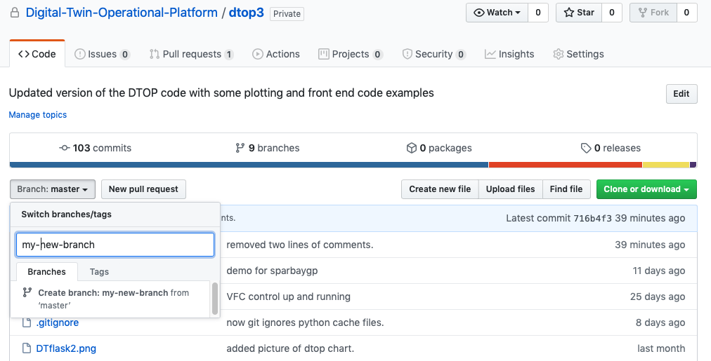

Contribute to the DTOP project
+++++++++++++++++++++++++++++++

This page explains how to create a page to display in the DTOP app.

Create your branch on GitHub
----------------------------

Clone our repository using:
---------------------------

.. code-block:: shell-session

    $ git clone git@github.com:Digital-Twin-Operational-Platform/dtop3.git

If you have your branch already, you wanna update it:

.. code-block:: shell-session

    $ git fetch origin
    $ git pull

Follow the steps in the README.md
---------------------------------

.. toctree::
   :maxdepth: 1

   start

Open your text editor (e.g. VS Code)
------------------------------------
1. Create new html file  ``./dtApp/templates/myinput.html`` from the snippet below:

.. code-block:: html
    :linenos:

    
    
    
    {{ super() }}
    
    

    <h1>Digital Twin Operational Platform (DTOP) for a 3-storey structure</h1>
    

        Welcome to the homepage for the Digital Twin Operational Platform (DTOP) for a 3-storey structure.
    

    
These webpages are designed to demonstrate the ideas being developed in the DigiTwin research project. More details
        of this reseach project can be found on the <a href="http://digitwin.ac.uk//">DigiTwin website.</a>

    

2. Open ``dtwin.html`` in the editor, and write the following line of code

.. code-block:: html
    :linenos:

    

        <a href="new-file">Title of my new page</a>
    

3. Create new file ``./dtApp/dtCode/myinput.py`` from the snippet below:

.. code-block:: python
    :linenos:

    '''
    '''
    from flask import render_template
    from dtApp import app

    @app.route('/myinput')
    def myinput():
        return render_template('myinput.html')

4. Add line to the ``./dtApp/routes.py`` as follows

.. code-block:: python
    :linenos:
    :emphasize-lines: 26

    '''
    routes.py
    ---------

    The core script of the dtop project

    Add to the list of import below your project module.
    '''

    from flask import render_template, request, redirect, Response, url_for
    from dtApp import app
    # At the moment each route file needs to be imported separately
    # Better to change this in future
    from .dtCode import dtopstruc
    from .dtCode import dplot
    from .dtCode import dplot2
    from .dtCode import dplot3
    from .dtCode import prop
    from .dtCode import plotlyex
    from .dtCode import dashboard
    from .dtCode import sheffalg
    from .dtCode import control
    from .dtCode import cadmodel
    from .dtCode import dplot4
    from .dtCode import sparbaygp
    from .dtCode import myinput

5. Go to ``http://localhost:5000`` and refresh the page.

Update your repository to current state of the project
==================================================================

1. Make a duplicate of your current repository and name it differently

.. code-block:: shell-session

    $ cp dtop3 dtop3_DATE

2. Enter your repository (of which now there is a duplicate)

.. code-block:: shell-session

    $ cd dtop3

3. Bring the changes to your current branch

.. code-block:: shell-session

    $ git fetch origin
    $ git pull origin master
    $ git commit –m 'any change you had made to update your repo'
    $ git push origin

4. You now have your branch in line with master.

Run flask at specified local port
==================================

On MacOS/Linux:

.. code-block:: shell-session

    (venv) % pip install -r requirements.txt

    (venv) % export FLASK_APP=run.py

    (venv) % export FLASK_DEBUG=1

    (venv) % export FLASK_RUN_PORT=8001

    (venv) % flask run

    On Windows just replace *export* with *set*.

